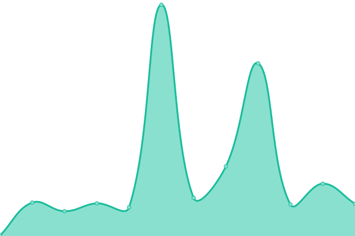

# [📈 Live Status](https://inifikry.github.io/upptime-inifikry): <!--live status--> **🟩 All systems operational**

This repository contains the open-source uptime monitor and status page for [inifikry](https://inifikry.github.io/upptime-inifikry), powered by [Upptime](https://github.com/upptime/upptime).

With [Upptime](https://upptime.js.org), you can get your own unlimited and free uptime monitor and status page, powered entirely by a GitHub repository. We use [Issues](https://github.com/inifikry/upptime-inifikry/issues) as incident reports, [Actions](https://github.com/inifikry/upptime-inifikry/actions) as uptime monitors, and [Pages](https://inifikry.github.io/upptime-inifikry) for the status page.

<!--start: status pages-->
<!-- This summary is generated by Upptime (https://github.com/upptime/upptime) -->
<!-- Do not edit this manually, your changes will be overwritten -->
<!-- prettier-ignore -->
| URL | Status | History | Response Time | Uptime |
| --- | ------ | ------- | ------------- | ------ |
|  [Google](https://www.google.com) | 🟩 Up | [google.yml](https://github.com/inifikry/upptime-inifikry/commits/HEAD/history/google.yml) | 

 469ms
     
 | 

<a href="https://inifikry.github.io/upptime-inifikry/history/google">100.00%</a>
    

|  [CasaOS (Direct)](http://213.35.102.255:666) | 🟩 Up | [casa-os-direct.yml](https://github.com/inifikry/upptime-inifikry/commits/HEAD/history/casa-os-direct.yml) | 

 429ms
     
 | 

<a href="https://inifikry.github.io/upptime-inifikry/history/casa-os-direct">100.00%</a>
    

|  [CASAOS](https://casaos.inifikry.xyz) | 🟩 Up | [casaos.yml](https://github.com/inifikry/upptime-inifikry/commits/HEAD/history/casaos.yml) | 

 3412ms
     
 | 

<a href="https://inifikry.github.io/upptime-inifikry/history/casaos">99.56%</a>
    

|  [Jellyfin](https://jellyfin.inifikry.xyz) | 🟩 Up | [jellyfin.yml](https://github.com/inifikry/upptime-inifikry/commits/HEAD/history/jellyfin.yml) | 

 1126ms
     
 | 

<a href="https://inifikry.github.io/upptime-inifikry/history/jellyfin">99.56%</a>
    

|  [YTPTube](https://ytptube.inifikry.xyz) | 🟩 Up | [ytp-tube.yml](https://github.com/inifikry/upptime-inifikry/commits/HEAD/history/ytp-tube.yml) | 

 796ms
     
 | 

<a href="https://inifikry.github.io/upptime-inifikry/history/ytp-tube">99.56%</a>
    

|  [N8N](https://n8n.inifikry.xyz) | 🟩 Up | [n8-n.yml](https://github.com/inifikry/upptime-inifikry/commits/HEAD/history/n8-n.yml) | 

 840ms
     
 | 

<a href="https://inifikry.github.io/upptime-inifikry/history/n8-n">99.56%</a>
    

|  [Radarr](https://radarr.inifikry.xyz) | 🟩 Up | [radarr.yml](https://github.com/inifikry/upptime-inifikry/commits/HEAD/history/radarr.yml) | 

 1281ms
     
 | 

<a href="https://inifikry.github.io/upptime-inifikry/history/radarr">99.56%</a>
    

|  [Sonarr](https://sonarr.inifikry.xyz) | 🟩 Up | [sonarr.yml](https://github.com/inifikry/upptime-inifikry/commits/HEAD/history/sonarr.yml) | 

 1056ms
     
 | 

<a href="https://inifikry.github.io/upptime-inifikry/history/sonarr">99.56%</a>
    

|  [Portainer](https://portainer.inifikry.xyz) | 🟩 Up | [portainer.yml](https://github.com/inifikry/upptime-inifikry/commits/HEAD/history/portainer.yml) | 

 923ms
     
 | 

<a href="https://inifikry.github.io/upptime-inifikry/history/portainer">99.56%</a>
    

|  [Gopeed](https://gopeed.inifikry.xyz) | 🟩 Up | [gopeed.yml](https://github.com/inifikry/upptime-inifikry/commits/HEAD/history/gopeed.yml) | 

 815ms
     
 | 

<a href="https://inifikry.github.io/upptime-inifikry/history/gopeed">99.56%</a>
    

<!--end: status pages-->

[**Visit our status website →**](https://inifikry.github.io/upptime-inifikry)

## 📄 License

- Powered by: [Upptime](https://github.com/upptime/upptime)
- Code: [MIT](./LICENSE) © [Anand Chowdhary](https://anandchowdhary.com), supported by [Pabio](https://pabio.com)
- Data in the `./history` directory: [Open Database License](https://opendatacommons.org/licenses/odbl/1-0/)
